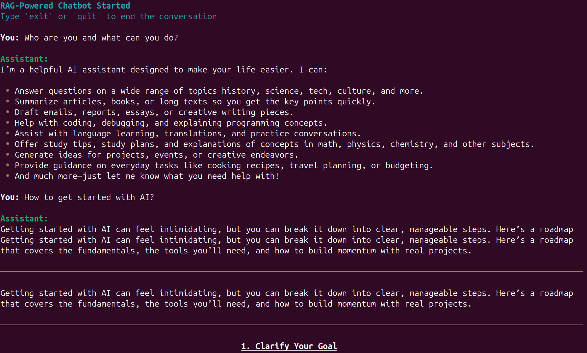

# gpt-oss-chat

A simple local RAG + web search pipeline powered by gpt-oss-20b via llama.cpp and similar scale models like NVIDIA Nemotron 3 Nano 30B A3B.

**Terminal chat powered by Rich Console UI**

 

**Gradio chat with a terminal theme**


## Setup Steps

* Install llama.cpp with CUDA

* Install Qdrant docker (optional). Qdrant Python client is mandatory for in memory vector DB and RAG

* Run `pip install -r requirements.txt`

* Create a `.env` file and add the [Tavily](https://www.tavily.com/) API key for web search. Optionally, you can also add the [Perplexity API key](https://docs.perplexity.ai/guides/search-quickstart).

  ```
  TAVILY_API_KEY=YOUR_TAVILY_API_KEY
  PERPLEXITY_API_KEY=YOUR_PERPLEXITY_API_KEY
  ```

## Running

**Start the llama.cpp server:**

```
./build/bin/llama-server -hf ggml-org/gpt-oss-20b-GGUF
```

**Terminal chat**

```
python api_call.py
```

**OR Gradio UI**

```
python app.py
```

---

## 📊 Sheets Agent (NEW!)

An intelligent Excel/CSV analysis agent with human-in-the-loop guidance. The agent can analyze spreadsheets, discover patterns, find relationships between sheets, and generate comprehensive reports.

### Features

- **Multi-format Support**: Excel (.xlsx, .xls) and CSV files
- **Large File Handling**: Chunked loading for files with 1000s of rows
- **Intelligent Analysis**: Automatic column type detection, pattern recognition, and data quality assessment
- **Relationship Discovery**: Finds connections between sheets through common columns and value overlaps
- **Human-in-the-Loop**: Interactive prompts for context and focus areas; agent can ask for clarification
- **Rich Outputs**: Markdown summaries, JSON hierarchies, and relationship maps

### Usage

**Basic usage:**
```bash
python sheets_agent.py --file /path/to/data.xlsx
```

**With custom output directory:**
```bash
python sheets_agent.py --file data.xlsx --output-dir ./my_analysis
```

**Auto mode (reduced interaction):**
```bash
python sheets_agent.py --file data.csv --auto
```

**All options:**
```bash
python sheets_agent.py --file data.xlsx \
  --output-dir ./analysis_output \
  --model model.gguf \
  --api-url http://localhost:8080/v1 \
  --max-rows 5000 \
  --chunk-size 1000 \
  --max-tool-calls 15
```

### Workflow

1. **Load File**: The agent loads your Excel/CSV file and displays an overview
2. **Context Input**: You provide context about what the data represents
3. **Focus Selection**: Choose which sheets to focus on (for multi-sheet workbooks)
4. **Agent Analysis**: The agent uses its tools to analyze the data:
   - Lists sheets and structure
   - Analyzes headers and column types
   - Identifies key columns and foreign keys
   - Finds relationships between sheets
   - Assesses data quality
5. **Interactive Feedback**: The agent may ask clarifying questions
6. **Output Generation**: Saves markdown summary, JSON hierarchy, and connection map

### Agent Tools

The sheets agent has access to 8 specialized tools:

| Tool | Description |
|------|-------------|
| `list_sheets` | List all sheets with row/column counts and headers |
| `analyze_headers` | Analyze column structure, types, and categories |
| `analyze_column` | Get detailed statistics for a specific column |
| `sample_data` | Get sample rows for inspection |
| `find_connections` | Discover relationships between sheets |
| `assess_quality` | Assess data quality (nulls, duplicates, issues) |
| `generate_summary` | Create comprehensive analysis summary |
| `request_user_feedback` | Ask user for guidance or clarification |

### Output Files

The agent generates three output files:

- **`summary_TIMESTAMP.md`**: Human-readable markdown report with all findings
- **`hierarchy_TIMESTAMP.json`**: Structured JSON with workbook schema, column types, and relationships
- **`connections_TIMESTAMP.json`**: Relationship map showing connections between sheets

### Example Output

```markdown
# Workbook Analysis Report

**File**: sales_data.xlsx
**Analysis Date**: 2026-01-31 19:51:00
**Total Sheets**: 3

## Executive Summary

This workbook contains **3 sheets** with a total of **15,234 rows** and **28 columns**.

## Sheet: "Orders"

**Rows**: 5,234 | **Columns**: 12 | **Quality Score**: 94/100

**Key Columns**: OrderID
**Potential Foreign Keys**: CustomerID, ProductID

### Column Details

| Column | Type | Null % | Unique |
|--------|------|--------|--------|
| OrderID | identifier | 0.0% | 5,234 |
| CustomerID | identifier | 0.2% | 1,847 |
| OrderDate | datetime | 0.0% | 731 |
| TotalAmount | currency/amount | 0.0% | 4,892 |

## Relationships

- **Orders.CustomerID** → **Customers.CustomerID** (many-to-one, 98% confidence)
- **Orders.ProductID** → **Products.ProductID** (many-to-one, 95% confidence)
```

### Requirements

The sheets agent requires additional dependencies (included in requirements.txt):

```
pandas
openpyxl
xlrd
tabulate
```

