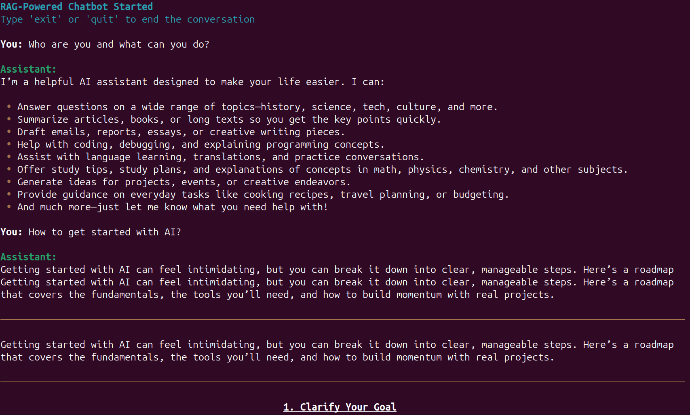
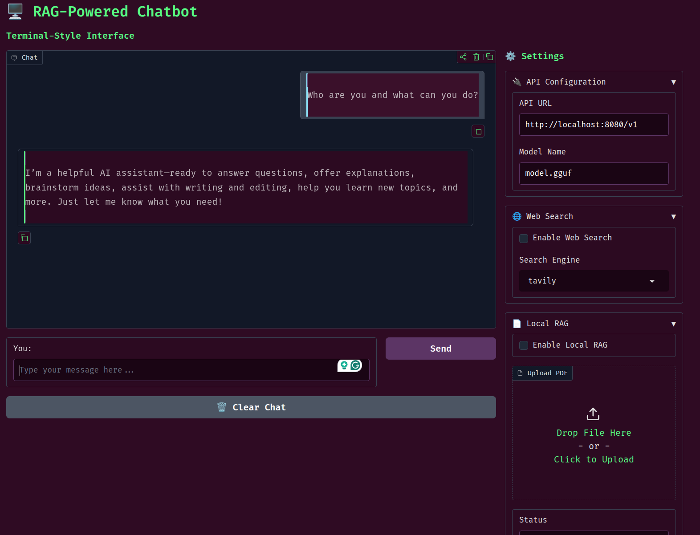

# gpt-oss-chat

A simple local RAG + web search pipeline powered by gpt-oss-20b via llama.cpp and similar scale models like NVIDIA Nemotron 3 Nano 30B A3B.

**Terminal chat powered by Rich Console UI**

 

**Gradio chat with a terminal theme**



## Setup Steps

* Install llama.cpp with CUDA

* Install Qdrant docker (optional). Qdrant Python client is mandatory for in memory vector DB and RAG

* Run `pip install -r requirements.txt`

* Create a `.env` file and add the [Tavily](https://www.tavily.com/) API key for web search. Optionally, you can also add the [Perplexity API key](https://docs.perplexity.ai/guides/search-quickstart).

  ```
  TAVILY_API_KEY=YOUR_TAVILY_API_KEY
  PERPLEXITY_API_KEY=YOUR_PERPLEXITY_API_KEY
  ```

## Running

**Start the llama.cpp server:**

```
./build/bin/llama-server -hf ggml-org/gpt-oss-20b-GGUF
```

**Terminal chat**

```
python api_call.py
```

**OR Gradio UI**

```
python app.py
```

### Advanced Usage in Terminal Mode

**Using local RAG to chat with any PDF file:**

```
python api_call.py --local-rag <path/to/pdf>
```

**Using local RAG as a tool where the LLM assistant decides when to search the document:**

```
python api_call.py --rag-tool <path/to/pdf>
```

***Other than the above, the LLM assistant always has access to web search. According to the user prompt it can decide when to search the web. It can either use Tavily or Perplexity search API based on the user prompt. Default is Tavily web search API. It can call multiple tools at its own discretion.***

e.g. Execute the script. The following shows the **web_search** tool call usage.

```
python api_call.py
```

**Prompt to search the internet to find about the latest information about LLMs:**

```bash
You: Find the latest information to search about LLMs  

Tool call 1: search_web ::: Args: {"topic":"latest information about LLMs","search_engine":"tavily"}
Checking if more tools are needed...
Tool call 2: search_web ::: Args: {"topic":"latest developments in large language models 2026","search_engine":"tavily"}
Checking if more tools are needed...
Tool call 3: search_web ::: Args: {"topic":"latest LLM developments 2026","search_engine":"tavily"}
Checking if more tools are needed...
 Total tools called: 3. Fetching final response...

Assistant: 

Here’s a quick snapshot of the most recent developments in large‑language‑model (LLM) research and product releases (as of early 2026).                                   
Feel free to dive deeper into any of the items below or use them as a starting point for your own searches.
```

**We can prompt to use the Perplexity web search API instead.**

```
You: Find the latest information to search about LLMs. Use the perplexity web search api.
.
.
.
Checking if more tools are needed...
Tool call 2: search_web ::: Args: {"topic":"latest information about LLMs","search_engine":"perplexity"}
Checking if more tools are needed...
```

We can also provide a particular URL and ask it to search. The following uses the **url_search** tool call.

```
You: What does this article contain? https://debuggercafe.com/hunyuan3d-2-0-explanation-and-runpod-docker-image/

Tool call 1: url_search ::: Args: {"url":"https://debuggercafe.com/hunyuan3d-2-0-explanation-and-runpod-docker-image/","search_engine":"tavily"}
Checking if more tools are needed...
 Total tools called: 1. Fetching final response...

Assistant: 
Short answer:                                                                                                                                                             
The article explains the new Hunyuan 3D 2.0 image‑to‑3D pipeline (its architecture, benchmarks, and contributions) and then walks through building a Runpod‑ready Docker  
image so you can run the whole workflow on a cloud GPU with minimal setup.
  Stage 2 – Texturing          Hunyuan3D‑Paint produces a texture map for the mesh using the input image.
```

**Local code directory search (uses grep)**

```
You: Search this codebase to find the syntax for Qwen3VL /home/sovit/Documents/transformers-main

Tool call 1: code_search ::: Args: {"directory":" /home/sovit/Documents/transformers-main","query":"Qwen3VL","max_results":10}
Checking if more tools are needed...
Tool call 2: search_web ::: Args: {"topic":"Qwen3VL syntax","search_engine":"tavily"}
Checking if more tools are needed...
 Total tools called: 2. Fetching final response...

Assistant: 

Here’s a concise example of how to load and use the Qwen3‑VL model with the transformers library.                                                                         
The snippet shows the typical import, model loading, processor setup, and a simple inference call.                                                                        
                           
 # 1️⃣ Import the necessary classes 
 from transformers import AutoModelForImageTextToText, AutoProcessor                                                                                                      
 # 2️⃣ Load the model (the "auto" dtype lets the library pick the best precision)
 #    device_map="auto" will automatically place the model on available GPUs              
 model = AutoModelForImageTextToText.from_pretrained(                                                  
     "Qwen/Qwen3-VL-235B-A22B-Instruct",        
     dtype="auto",                     
     device_map="auto",                                          
     # Uncomment the lines below for faster attention (requires flash_attention_2)
     # dtype=torch.bfloat16,
     # attn_implementation="flash_attention_2",                                
 )                                                      
```

